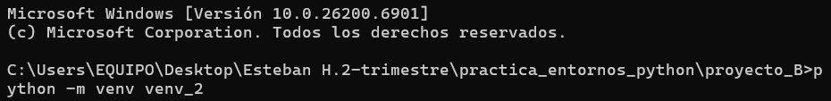

# practica_entornos_python

## Versión de Python utilizada
Python 3.11.2

---


## Descripción general de la actividad
En esta práctica, exploramos el fascinante mundo de los entornos virtuales en Python, aprendiendo a crearlos y gestionarlos eficientemente. El objetivo principal fue desarrollar dos proyectos independientes, cada uno en su propio espacio aislado.


¿Qué se realizo?
- Creamos dos entornos virtuales separados
- Instalamos diferentes paquetes según las necesidades de cada 
- Desarrollamos y ejecutamos scripts específicos

- **Proyecto A:** Uso de *Jupyter Notebook*.  
- **Proyecto B:** Uso de *Pandas* para análisis de datos.

Los entornos virtuales no se incluyen en el repositorio por buenas prácticas, pero mantenemos los requirements.txt para poder replicar el ambiente de desarrollo.


---

##  Actividades realizadas :

### 1️⃣.Creación de los entornos virtuales.

   capturas de `python -m venv venv_1`
  


 `python -m venv venv_2`
 


---

### 2️⃣.Activación de los entornos.
 
  capturas de 
  `venv_1\Scripts\activate`
  
    
  `venv_2\Scripts\activate`
  


---

### 3️⃣.Instalación de los paquetes (jupyter / pandas).
  capturas de 
  `pip install jupyter`
  
  
   `pip install pandas` 
   

---

### 4️⃣.Ejecución de los scripts y notebooks.
  capturas de :
  `python src/algoritmo_a.py`
  
  
  `jupyter notebook src\notebook_a.ipynb`salida del  notebook
  

   `python src/algoritmo_b1.py`
   

   `python src/algoritmo_b2.py`
   


---


### 5️⃣Contenido de los archivos requirements.txt.
  capturas mostrando el contenido de :
  `proyecto_A/requirements.txt`
  


  `proyecto_B/requirements.txt`
  

---
### 6️⃣.Enlace al repositorio público de GitHub.

### 7️⃣.Estructura de carpetas visible en Visual Studio Code o en terminal.

````

PRACTICA_ENTORNOS_PYTHON/

│
├─ img/
│  ├─ active_venv1.png
│  ├─ active_venv2.png
│  ├─ algoritmo_b1.png
│  ├─ algoritmo_b2.png
│  ├─ algoritmo_A.png
│  ├─ jupyter.png
│  ├─ notebook.png
│  ├─ pandas.png
│  ├─ requirementsA.png
│  ├─ requirementsB.png
│  ├─ venv1.png
│  ├─ venv2.png
│
├─ proyecto_A/
│  ├─ src/
│  │  ├─ algoritmo_a.py
│  │  └─ notebook_a.ipynb
│  ├─ venv_1/
│  ├─ README_A.md
│  └─ requirements.txt
│
├─ proyecto_B/
│  ├─ src/
│  │  ├─ algoritmo_b1.py
│  │  └─ algoritmo_b2.py
│  ├─ venv_2/
│  ├─ README_B.md
│  └─ requirements.txt
│
├─ .gitignore
└─ README.md

```


